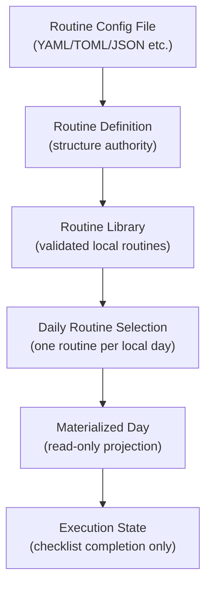

# Samoyed Design

本文档定义 Samoyed 的 iOS 产品结构、界面层级和术语。当前设计以 [PRD.md](PRD.md) 为准：Samoyed 是一个 routine runner，少数稳定 Day Type 通过 weekday default 自动运行；App 负责物化、展示、提醒、checklist 执行与当天例外。

如果本文档与 PRD 冲突，以 PRD 为准。

## 1. Design Goal

Samoyed 的界面目标是让用户稳定运行已经定义好的 routine，而不是在手机上临时规划或编辑一天。

UI 应帮助用户完成四件事：

- 导入并理解可运行的 Routine Definition。
- 让 weekday default 自动运行，只有当天例外才要求显式选择。
- 查看当天 Materialized Day，并在必要时做 Today-only correction。
- 在执行过程中完成 checklist item。

UI 不应承担：

- 可视化 routine builder。
- Today 页面里的 block 创建、删除、reparent、拖拽 resize、cancel 或 checklist/reminder 编辑。
- 从当天临时结构保存为 routine。
- task inbox 或 ad hoc todo capture。

## 2. Core Mental Model

用户心智应始终是：

1. 我先在配置文件或外部工具里定义 routine。
2. 我把 Routine Config File 导入 Samoyed。
3. App 根据 weekday default 自动选择今天的 routine。
4. 只有“Today is different”时，我才选择日期级例外。
5. App 把选择物化为当天运行快照；Today-only correction 和 checklist completion 都不会改动 Saved Day Type。

## 3. Terminology

### 3.1 Routine Definition

`Routine Definition` 是 routine 结构的唯一权威来源。

它描述：

- routine 元信息，例如名称、说明、版本。
- block 结构。
- overlay / nested block 关系。
- 时间规则。
- note。
- checklist item。
- reminder rule。

它不保存：

- 某一天 checklist 的完成状态。
- 某一天的运行进度。
- 用户在当天临时做过什么。

### 3.2 Routine Config File

`Routine Config File` 是承载 `Routine Definition` 的具体文件。

产品概念不绑定 YAML。当前实现可以先支持 YAML，但设计语言应始终使用 `Routine Config File`，为 TOML、JSON 或其他可校验格式保留空间。

### 3.3 Routine Library

`Routine Library` 是本地保存的、已导入并通过校验的 Routine Definition 集合。

它负责：

- 展示可运行 routine。
- 预览 routine 的结构。
- 导入 Routine Config File。
- 导出 Routine Config File。
- 作为每日 routine 选择的来源。

它不是：

- 手机端 routine 编辑器。
- 模板编辑器。
- 当天计划编辑器。

### 3.4 Daily Routine Selection

`Daily Routine Selection` 是某个本地自然日选择的唯一 routine。

v1 规则：

- 一个自然日只能选择一个 routine。
- 不支持多个 routine 组合运行。
- 不通过 Today 页面拼装 routine。
- 切换今天的 routine 是明确的日级选择，不是 block 级编辑。

### 3.5 Materialized Day

`Materialized Day` 是 Daily Routine Selection 在某个日期上的运行快照；它可以包含不写回来源 routine 的 Today-only correction。

它包含：

- 当天 block 时间线。
- note。
- checklist item。
- reminder。
- 当前 active block / task source 等运行推导。

Materialized Day 可以缓存或持久化，但不能成为 routine 结构的权威来源。

### 3.6 Execution State

`Execution State` 是某一天的运行状态。

它包含：

- checklist item 是否完成。
- 完成时间。
- 当天当前选择或 UI selection。

它不改变：

- Routine Definition。
- Routine Config File。
- Routine Library 中的 routine 结构。

## 4. Data Hierarchy

结构状态和执行状态必须分离：

- Structure state 来自 Routine Definition。
- Execution state 属于某一天。
- Checklist completion 不回写 Routine Definition。

## 5. Root Navigation

根界面使用 `TabView`，固定三个一级页面：

1. `Now`
2. `Today`
3. `Library`

推荐图标：

- `Now`: `bolt.circle`
- `Today`: `calendar`
- `Library`: `square.stack.3d.up`

## 6. Now

### Purpose

`Now` 回答：现在这个 routine 运行到哪里了？

### Shows

- 当前 active block。
- 当前 note。
- 当前 checklist item 或 checklist section。
- 距离当前 block 结束或下一段开始的时间提示。
- 当天尚未选择 routine 时的选择入口。

### Allows

- 勾选当前 checklist item。
- 打开 Today 中对应位置。
- 打开 Library 选择今天 routine。

### Does Not Allow

- 编辑 block。
- 编辑 note。
- 编辑 checklist 内容。
- 改时间。
- 新增临时任务。

## 7. Today

### Purpose

`Today` 回答：今天自动或显式选择的 routine 被物化成了什么结构，今天是否需要轻量修正？

### Shows

- 查看优先的 timeline。
- block / overlay 层级。
- open time gap。
- selected block detail。
- note、checklist、reminder 的只读内容。
- checklist completion state。

### Allows

- 选择 block 查看详情。
- 展开或收起详情面板。
- 跳到当前 active block。
- 勾选 checklist item，前提是该 checklist item 是执行状态的一部分。
- 通过明确的 Today-only 入口修正既有 block 的标题、开始/结束时间和 note。

### Does Not Allow

- 创建 block。
- 修改 checklist、reminder 或 block 层级。
- 拖拽或 resize block。
- cancel block。
- add overlay。
- 保存今天为 routine。
- 将 open time gap 转换为 block。

## 8. Library

### Purpose

`Library` 回答：有哪些已确认的 routine 可以运行？今天要运行哪一个？

### Top-Level Areas

- `Routines`: Routine Library，展示已导入 routines，并允许选择今天的 routine。
- `Routine Config Files`: 导入、校验、导出配置文件。
- `Settings`: 与 routine 结构无关的显示偏好。

### Routines

Routines 页面应展示：

- 今日 routine 选择状态。
- Routine Library 中的 routine 列表。
- 每个 routine 的只读预览。
- block、overlay、checklist、reminder 的摘要。
- `Select for Today` 操作。

Routines 页面不展示：

- 编辑 routine 的 form。
- 从近期日期保存 routine 的按钮。
- weekday default / special day override 编辑器。
- tomorrow regenerate / rebuild 操作。

### Routine Config Files

Routine Config Files 页面应展示：

- Import Routine Config File。
- 通过 `samoyed://import-routine` 接收 Base64URL 内嵌 YAML 或 HTTPS YAML，并在 App 内解码/下载、校验和预览。
- 导入预览和校验结果。
- 导入后加入 Routine Library。
- Export Selected Routine。

导入行为必须是 library-level 操作：

- 不替换今天的 Materialized Day。
- 不修改当天 Execution State。
- 不把 checklist completion 混入 Routine Definition。
- deeplink 只作为传输来源；必须由用户确认后保存本地副本，不建立持续同步关系。

## 9. System Surfaces

Widgets、Live Activities、Controls、Shortcuts、notifications 只服务运行和显示：

- 展示当前 routine 状态。
- 打开 Now、Today 或 Library。
- 完成当前 checklist item。

它们不得暴露：

- 创建 block。
- 编辑时间。
- 修改 routine。
- 切换结构，除非跳转回 App 进行明确的 Daily Routine Selection。

## 10. Visual Direction

整体视觉应接近 Apple 原生系统应用：

- 使用 `TabView`、`NavigationStack`、`List`、`ScrollView`、toolbar、sheet。
- 使用系统分组背景。
- 使用 SF Symbols。
- 使用动态字体。
- 保持信息密度清晰，不做营销式 landing page。

Today timeline 可以定制视觉，但必须保持查看优先、修正受限的心智：

- selected state 可以高亮。
- open gap 可以显示，但不应使用加号暗示新增。
- block detail 只允许一个明确标记为 Today only 的轻量修正入口，不出现通用编辑 action group。

## 11. Implementation Notes

当前代码中仍可能存在历史内部命名，例如 `TemplateEngine`、`SavedDayTemplate`、`TemplatesScreenModel`。这些是迁移期实现细节，不应出现在用户可见文案中，也不改变产品术语：

- 用户可见术语使用 Routine。
- 配置文件使用 Routine Config File。
- 结构权威使用 Routine Definition。
- 本地集合使用 Routine Library。

长期可以逐步把内部命名迁移到 Routine，但迁移不应重新引入 App-side editor。

## 12. Acceptance Checklist

- Today 没有 block create/delete/reparent/drag-resize/cancel/add overlay，也不编辑 checklist/reminder。
- Today 没有 save today as routine。
- Library 使用 Routines 和 Routine Config Files 术语。
- Routine Config File import 加入 library，不替换今天。
- weekday default 自动运行；“Today is different”只覆盖某个日期且不改变 usual week。
- Checklist completion 只改变 Execution State。
- System surfaces 不提供结构编辑能力。
